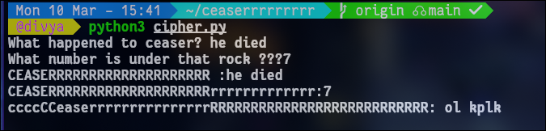
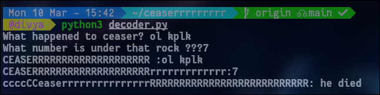

# Caesar Cipher Encoder & Decoder

This project provides a simple implementation of the **Caesar Cipher**, a substitution cipher where each letter in the plaintext is shifted by a specific number of positions down or up the alphabet. The project includes both the encoder and decoder functionality to easily encrypt and decrypt messages.

## How It Works

The Caesar Cipher works by shifting the characters of the input text by a specified number, called the **shift number**. It treats both uppercase and lowercase letters differently, leaving non-alphabet characters (such as spaces and punctuation) unchanged.

- **Encoder**: Shifts each letter by a specified number of positions to generate the encoded message.
- **Decoder**: Reverses the shift and returns the original message.

## Example Usage

### Encoder Interaction

When you run the encoder, you will be prompted to enter the text you want to encode and the number of positions (shift) to apply. For example:

#### Sample Interaction:

### Decoder Interaction

When you run the decoder, you will input the encoded message and the same shift number used during encoding. The program will then decrypt the message and return the original text.

#### Sample Interaction:

## Future Enhancements

- Additional features like handling different shift patterns or integrating more cipher types may be added in the future.
- Making this into a complex tool that can handle spaces. punctuation and special characters
---

**Note:** This cipher works best for alphabetic characters. Spaces, punctuation, and special characters are unaffected by the encoding or decoding process.

